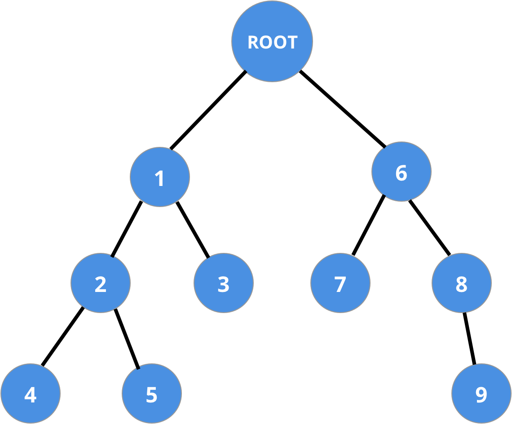
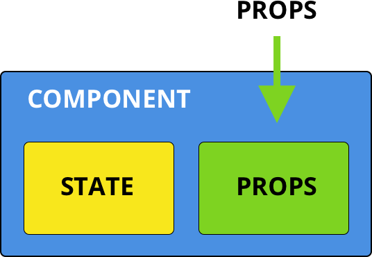
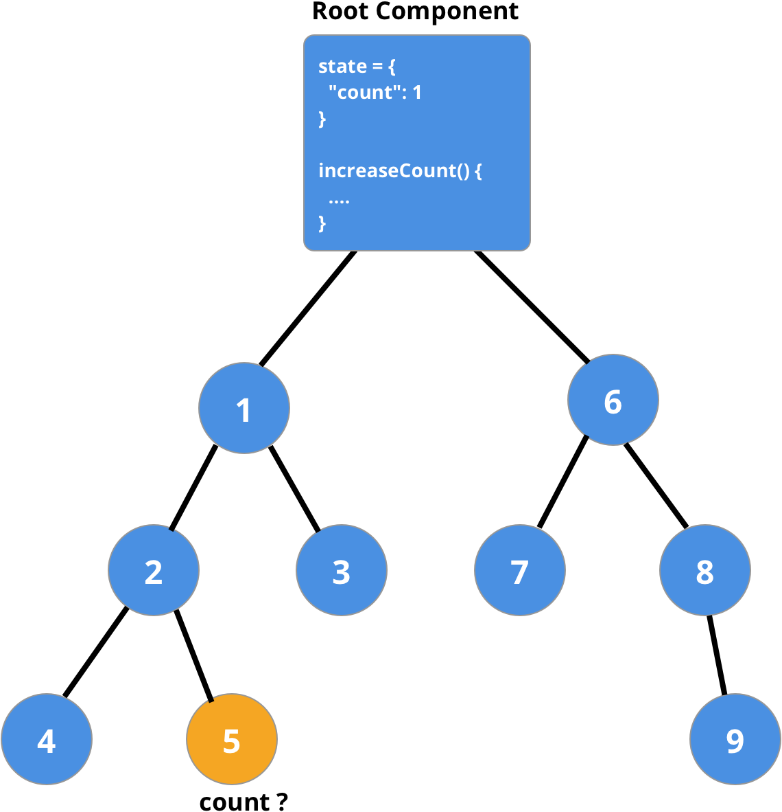
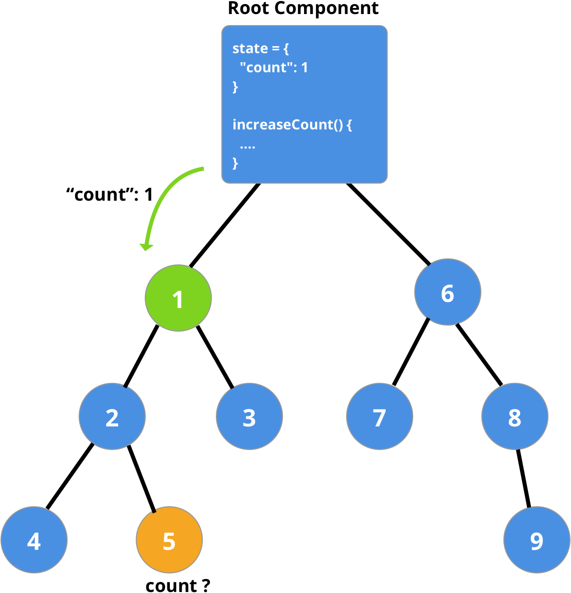
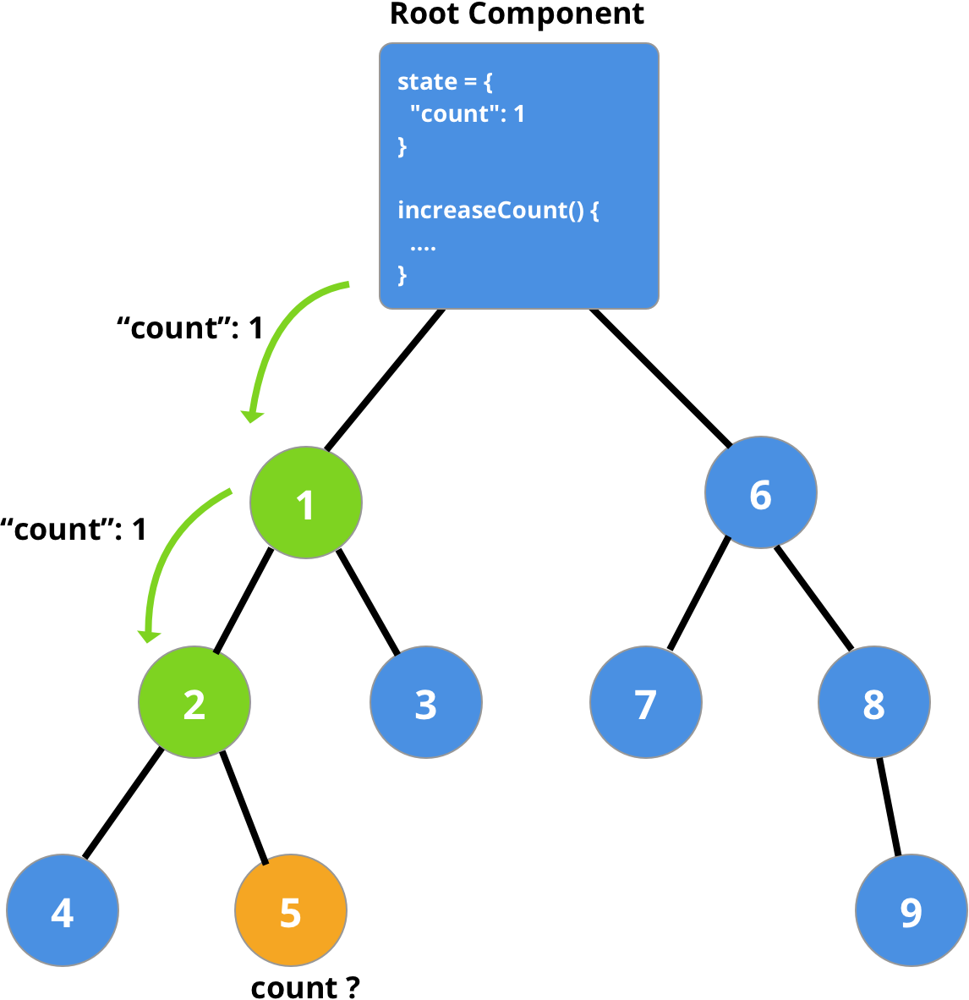
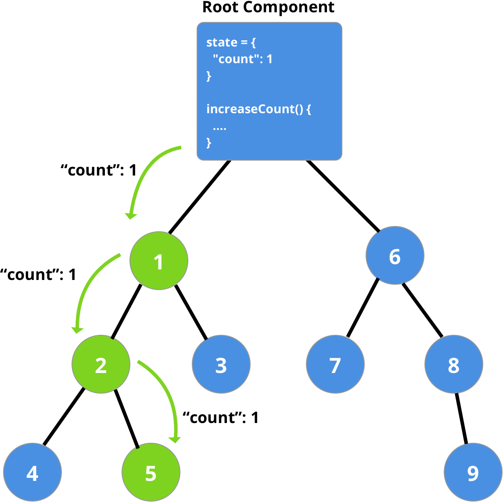
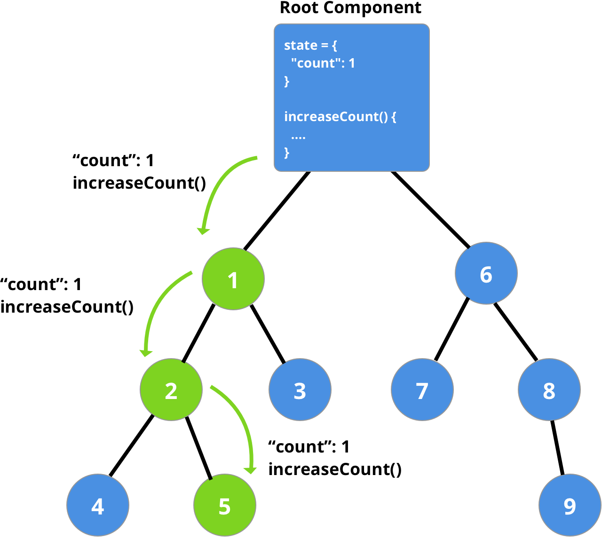
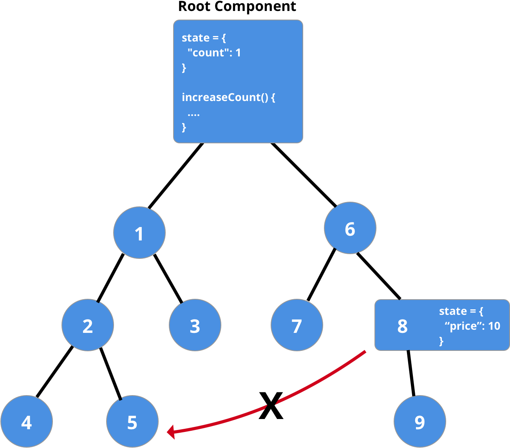
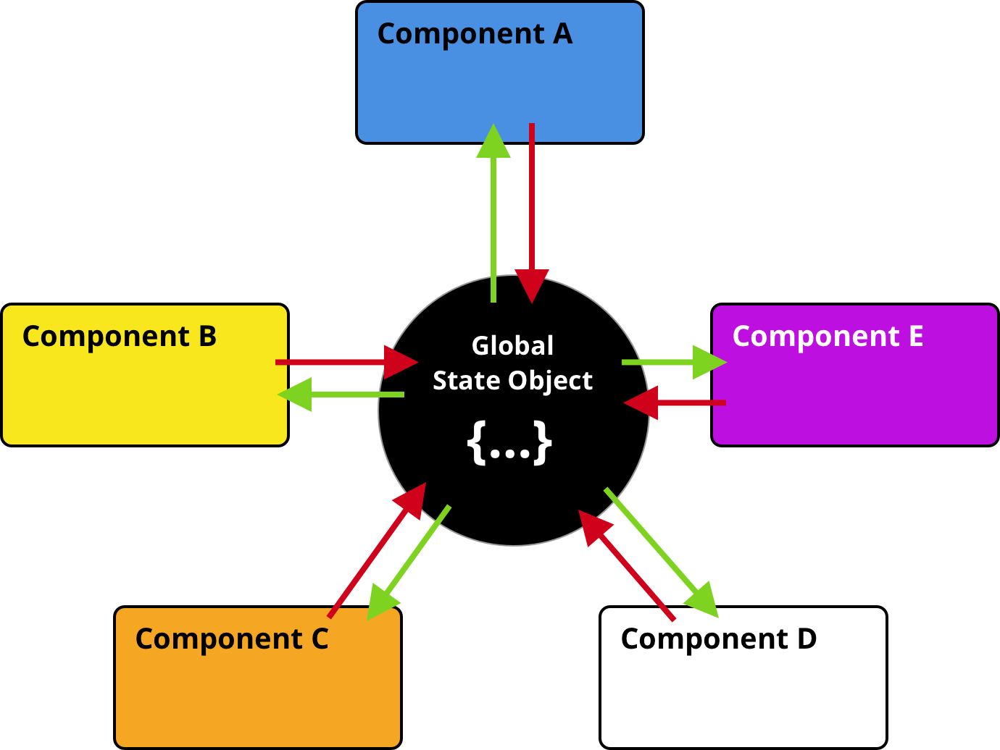
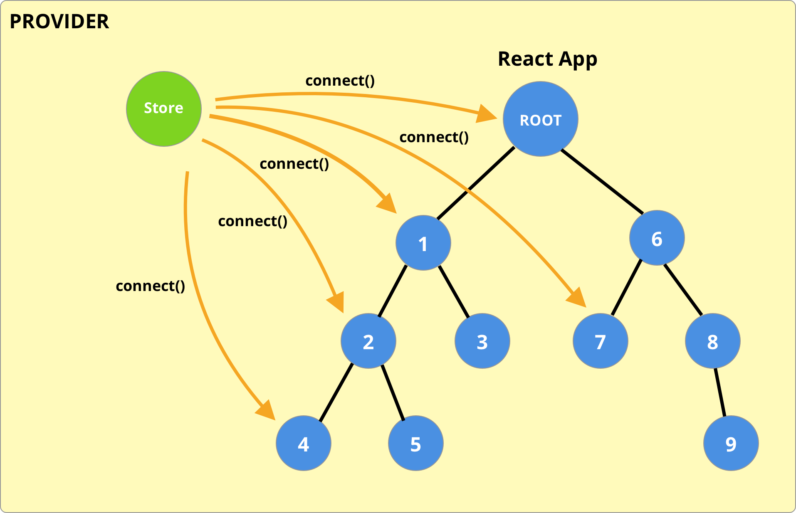

<!-- .slide: data-state="triangle" -->

# STATE MANAGEMENT

<br>
## M. HAZAR ARTUNER
__*Frontend Developer, VNGRS*__
---
## KLASİK WEB UYGULAMALARINDA STATE
---
## SINGLE PAGE UYGULAMALARDA STATE
---
## REACT UYGULAMALARINDA STATE
---
<!-- .slide: class="image-l" data-state="fancy" data-background="#fff" -->
## React App


---
<!-- .slide: class="image-m" data-state="fancy" data-background="#fff" -->


---
<!-- .slide: class="image-m" data-state="fancy" data-background="#fff" -->


---
<!-- .slide: class="image-m" data-state="fancy" data-background="#fff" -->


---
<!-- .slide: class="image-m" data-state="fancy" data-background="#fff" -->


---
<!-- .slide: class="image-m" data-state="fancy" data-background="#fff" -->


---
<!-- .slide: class="image-m" data-state="fancy" data-background="#fff" -->


---
<!-- .slide: class="image-m" data-state="fancy" data-background="#fff" -->


---
## Peki o zaman,
## State paylaşımını nasıl yapabiliriz?
---
<!-- .slide: class="image-m" data-state="fancy" data-background="#fff" -->
## GLOBAL STATE

---
## Global State Yönetemi İçin Kullanılan
## Bazı Api ve Kütüphaneler
- React Context Api
- Mobx
- Redux
---
## REDUX
Javascript uygulamaları için, davranışı öngörülebilir, kestirilebilir bir State taşıyıcısıdır.
---
## Redux'ın Üç Prensibi
- Single source of truth (store)
- State doğrudan değiştirilmemeli (actions)
- Değişiklikler Pure fonksiyonlar ile yapılır (reducers)
---
# DEMO
## Redux with Vanilla JS
https://github.com/hazarartuner/redux-with-vanilla-js
---
<!-- .slide: class="image-xl" data-state="fancy" data-background="#fff" -->
## REDUX FLOW

---
## REDUX with REACT
**REACT**’ın **REDUX** ile bağlantısını sağlamak için 
yine **REDUX** ekibi tarafından geliştirilen 
“react-redux” kütüphanesini kullanabiliriz.

https://react-redux.js.org/
---
## react-redux
- Provider component
- connect() function
---
## PROVIDER
> Provider, redux store'unun, altında bulunan component'lara dağıtılmasını sağlar.

https://react-redux.js.org/api/provider
<!-- .element class="footnote" -->
---
#### Provider Kullanımı Örneği
<!-- .slide: class="slide code-s" -->
```js
import React from "react";
import ReactDOM from "react-dom";
import { Provider } from "react-redux";
import { createStore } from "redux";

import { ComponentA } from "./components/ComponentA";
import { ComponentB } from "./components/ComponentB";
import { ComponentC } from "./components/ComponentC";

import reducers from "./redux/reducers";

const store = createStore(reducers);

ReactDOM.render(
  <Provider store={store}>
    <ComponentA>
      <ComponentB>
        <ComponentC/>
      </ComponentB>
    </ComponentA>
  </Provider>,
  document.getElementById("root")
);
```
---
## CONNECT
> connect() fonksiyonu, React component'ini Redux store'una bağlar.

https://react-redux.js.org/api/connect
<!-- .element class="footnote" -->
---
## Connect
<!-- .slide: class="slide code-s" -->
```js
function connect(mapStateToProps?, mapDispatchToProps?, mergeProps?, options?)
```
---
### mapStateToProps?: Function

**Aldığı Parametreler**
1. state: Object
2. ownProps?: Object
---
### mapDispatchToProps?: Function | Object

**Aldığı Parametreler**
1. dispatch: Function
2. ownProps?: Object
---
<!-- .slide: class="image-xl" data-state="fancy" data-background="#fff" -->


---
# DEMO

https://github.com/hazarartuner/redux-with-react/tree/feature/redux
---
# Asynchronous Actions
> dispatch it later
---
## Async Actions with "redux-thunk"

https://github.com/reduxjs/redux-thunk
---
<!-- .slide: class="image-xl" data-state="fancy" data-background="#fff" -->


---
# DEMO

https://github.com/hazarartuner/redux-with-react/tree/feature/redux-with-async-actions
---
## Teşekkürler :)