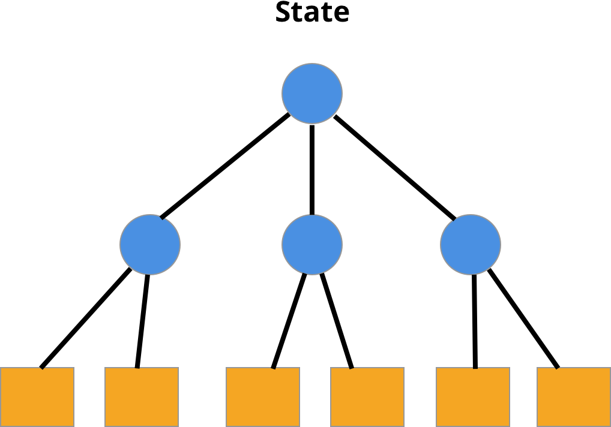
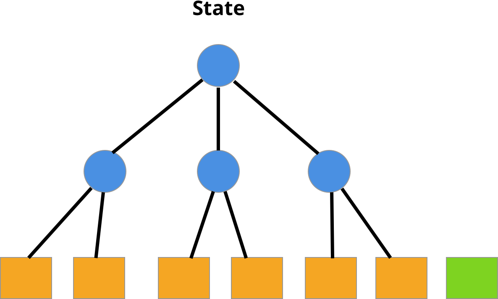
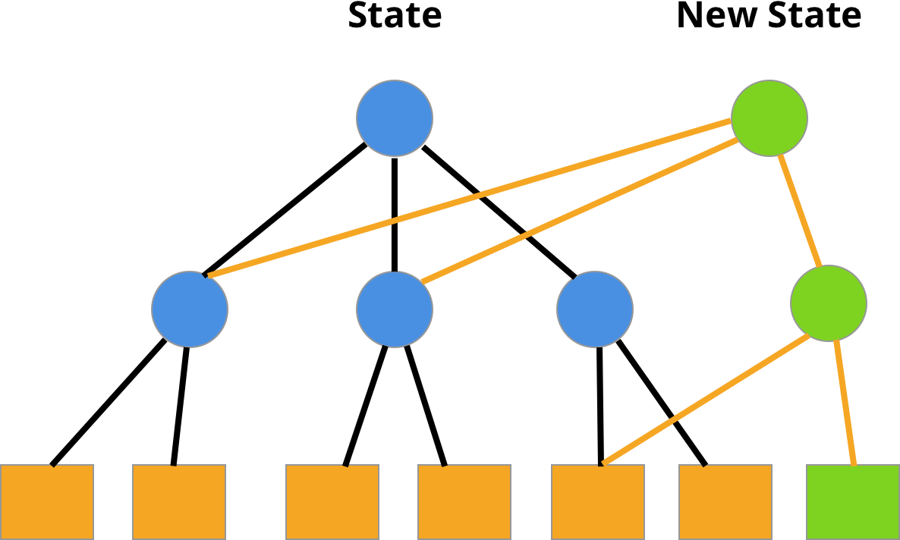

<!-- .slide: data-state="triangle" -->

# TESTING REDUX

<br>
## M. HAZAR ARTUNER
__*Frontend Developer, VNGRS*__
---
# Jest
## Testing Framework

https://jestjs.io/
---
Kurulum
```bash
yarn add --dev jest
```
package.json'a ekle
```json
{
  "scripts": {
    "test": "jest"
  }
}
```
testlerini çalıştır
```bash
yarn test
```
---
test dizini
```bash
__tests__
```

test dosyaları
```bash
*.spec.js
*.test.js
```
---
# Demo
---
# Reselect
Redux için kullanılan bir "selector" kütüphanesi.

https://github.com/reduxjs/reselect
---
```js
createSelector(...inputSelectors | [inputSelectors], resultFunc)
```
---
```js
const { createSelector } = require('reselect');

const state = {
  numbers: [1,2,3,4,5,6,7,8,9,10],
  greaterThan: 2
};

const getNumbers = state => state.numbers;
const getGreaterThan = state => state.greaterThan;

const numberSelector = createSelector([ getNumbers, getGreaterThan ],
  (numbers, greaterThan) => {
    return numbers.filter(number => number > greaterThan);
  });

const selectedNumbers = numberSelector(state);
console.log(selectedNumbers); // prints [3,4,5,6,7,8,9,10]
```
---
# Immutable Data
- Easy change detection
- Memoization
- Implement time-traveling, undo/redo easily
---
## Javascript'te object ve array değişkenler "IMMUTABLE DEĞİL"
---
```js
const numbers = [4,6,2,3,9,1,5,7];
const sortedNumbers = numbers.sort();

console.log('numbers: ', numbers);
console.log('sortedNumbers: ', sortedNumbers);

console.log(numbers === sortedNumbers);
```
---
```js
const numbers = [4,6,2,3,9,1,5,7];

function doSomething(arg) {
  arg.push(100);
  //...
}

doSomething(numbers);

console.log(numbers);
```
---
## Çözüm Önerileri
---
```js
const numbers = [4,6,2,3,9,1,5,7];
const sortedNumbers = [...numbers].sort();

console.log('numbers: ', numbers);
console.log('sortedNumbers: ', sortedNumbers);

console.log(numbers === sortedNumbers);
```
---
```js
const numbers = [4,6,2,3,9,1,5,7];

function doSomething(arg) {
  const newNumbers = [...arg].push(100);
  //...
}

doSomething(numbers);

console.log(numbers);
```
---

## Immutable.js

https://github.com/immutable-js/immutable-js
---

<!-- .slide: class="image-l" data-state="fancy" data-background="#fff" -->



---
<!-- .slide: class="image-l" data-state="fancy" data-background="#fff" -->



---

<!-- .slide: class="image-l" data-state="fancy" data-background="#fff" -->


---
## Map
- get(key)
- set(key, value)
- delete(key)
- getIn(keyPath: Array)
- setIn(keyPath: Array, value)
- deleteIn(keyPath: Array)
---
```js
const { Map } = require('immutable');

const state = Map({
  firstName: "John",
  lastName: "Doe",
  contactInfo: {
    phone: '05555555555',
    email: 'john.doe@somemail.com'
  }
});

let firstName = state.get('firstName');
console.log(firstName);
```